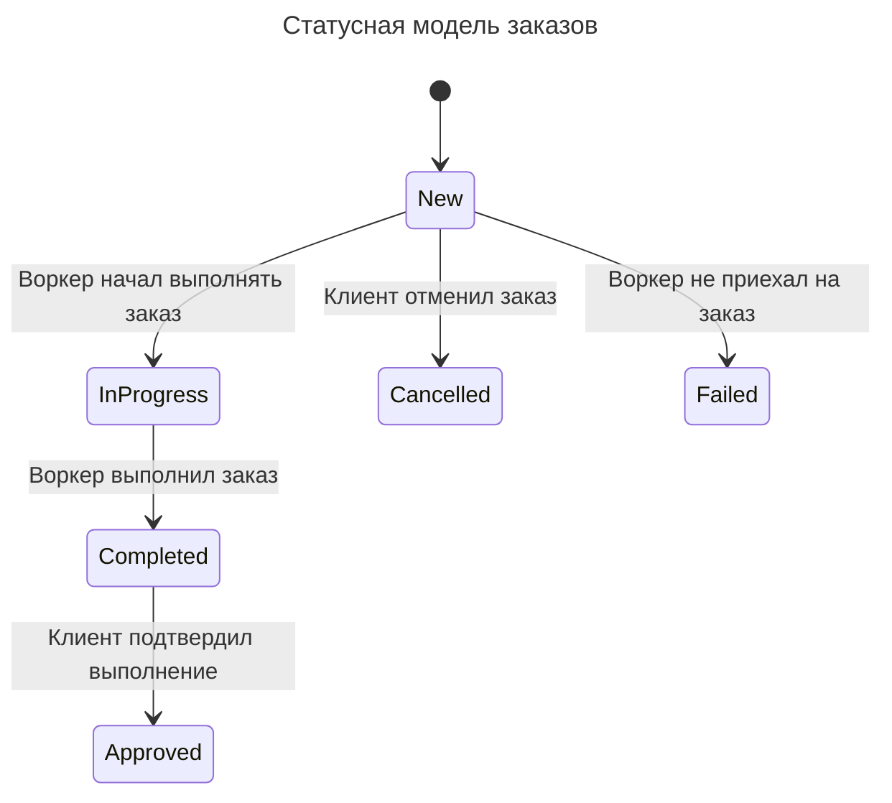

# Make cats free again

## Модуль заказов
Единый сервис для клиента и воркера. В нём клиент может посмотреть историю заказов, создать новую, и отменить старую

Воркер в это модуле посмотреть список активных и завершенных заданий. Также здесь он может получить новое задание.

Матчинг заказов и воркера производится здесь же.

Т.к. получение списка заказов тривиальны, то рассматривать их тут мы не будем

### Настройка типа услуг
1. Менеджер создает новый тип услуги
2. Тип становится доступен при создании заказ

### Создание заказа (или копии)
1. Клиент заполняет форму и создаёт заказ в статусе "New"
2. Клиент выбирает дату
3. Запускается матчинг с воркером
4. Информация о заказе отправляется в модуль ставок

### Отмена заказа
1. Клиент отменяет заказ
2. Заказ переходит в статус "Cancelled"
3. Отменяется матч воркера и заказа
4. Отправляется уведомление воркеру

### Матчинг
1. Происходит матчинг воркера из пула и заказа
2. Заказ назначается воркеру
3. Расчитывается базовая стоимость заказа
4. Информация о заказе отправляется в модуль оплаты
5. Отправляется уведомление воркеру
6. Отправляется уведомление клиенту

### Провал заказа
1. При истечении даты выполнения, если заказ не выполнена, то он переходит в статус "Failed"
2. Отправляется уведомление клиенту
3. Информация о провале отправляется в модуль оплаты
4. Информация о заказе отправляется в модуль аналитики
4. Информация о заказе отправляется в модуль ставок

### Взятие заказа
1. Воркер отметился в приложении о начале выполнения заказа
2. Отправляется уведомление клиенту

### Выполнение заказа
1. Воркер выполняет "работу"
2. Воркер отправляет отчёт с подписью клиента
3. Заказ переходит в статус выполнен
4. Отправляется уведомление клиенту

### Подтверждение выполнения заказа
1. Пользователь подтверждает заказ и переводит его в статус "Approved"
2. Отправляется уведомление воркеру
3. Информация о заказе отправляется в модуль аналитики
4. Информация о заказе отправляется в модуль ставок

## Модуль расходников

Модуль в котором работают воркеры и снабженцы. Здесь оставить заявку на коплект расходников, а снабженцы -- посмотреть её

### Заказ расходников 
1. Воркер заказывает расходники
2. Отправляется заявка на печенье
3. Отправляется уведомление снабженцам

### Сборка комплекта
1. Снабженец дожидается печенья
2. Снабженец собирает коплект
3. Снабженец отмечает коплект собранным
4. Воркеру отправляется уведомление

### Получение комплекта
1. Воркер получает комплект

## Модуль ставок

Модуль, в котором менеждеры ставят ставки на заказы

### Сделать ставку
1. Менеджер выбирает заказ и ставить ставку на выполнение/не выполнение и определенные условия

### Обработка обновления статуса заказа
1. При появлении события о переходе заказа в статус "Failed" или "Approved" система выносит решение по ставке

## Модуль регистрации воркеров

Модуль в котором менеджеры могут отбирать воркеров для выполнения заказов

### Заявка на регистрацию
1. Кандидат оставляет заявку на регистрацию
2. Заявка попадает в очередь на обработку менеджером

### Обработка заявки
1. Менеджер рассматривает заявки
2. Менеджер назначает набор тестов

## Выполнение тестов
1. Кандидат выполняет тесты

## Проверка тестов
1. Менеджер првоеряет тесты
   1. Кандидат бракуется
   2. Кандидат признаётся годным и отправляется в пул воркеров в Модуле заказов
      1. Характеристики воркера кодируются

## Модуль аналитики

Модуль, в котором происходит проверка качества заказов. Сюда попопадает вся информация из модулья заказов.

### Менеджер изучил заказ
1. Заполняется форма контроля качества
2. Отправляется уведомление клиенту
3. Отправляется уведомление воркеру

## Модуль оплаты

Модуль, который расчитывает, сколько денег надо снять с клиента и сколько надо заплатить воркеру. Сюда попадает информация о всех выполненных и проваленных заказах. Также здесь хранится история для системы лояльности

### Посчитать доход за месяц
1. Воркер запрашивает подсчет дохода
2. Базовая цена всех выполненных воркером заказов умножается на 0.6 и складывается
3. Отнимается количесто проваленных заказов * 40 к.е.

### Посчитать расход за неделю
1. Базовая цена всех созданных клиентом заказов умножается на коэффициент программы лояльности

### Посчитать коэффициент лояльности
1. Считается сумма всех заказов клиента. 
2. В зависимости от суммы расчитывается коэффициент

### Сформировать инвойс
1. Считается расход за неделю (календарную)
2. Создаётся инвойс в выбранном способе оплаты
3. Отправляется уведомление клиенту

### Оплатить работу воркера
1. Считается доход за месяц (календарный)
2. Формируется платёж
3. Отправляется уведомление воркеру